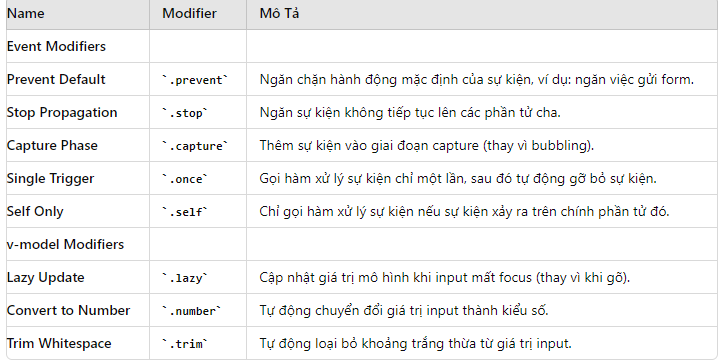

Vue 3 tutorial

## 🌀 Logos
- **Vuejs:** <code>3x</code><br/>
- **Vuetify:** <code>3x</code><br/>
- **Vuerouter:** <code>4x</code><br/>
- **Axios:** <code>4x</code><br/>
- **Pinia:** <code>4x</code><br/>
- **Vuex:** <code>4x</code><br/>

## 🚀 Quickstart
- Step 1: Clone <code>https://github.com/hogibpro98/docker-compose-template</code> 
- Step 2: Open with live server (Extension)

<table>
 <tr valign="top" style="vertical-align:top">
  <td>
   <strong>	Essentials</strong><br/>
<details>
    <summary>⭐:<code>Creating an Application</code></summary>
</details>

<details>
    <summary>⭐:<code>Template Syntax</code></summary>

1. Text Interpolation
```
<span>Message: {{ msg }}</span>
```
2. Raw HTML <strong style="color:red">Not use</strong> 
```
Security Warning
Dynamically rendering arbitrary HTML on your website can be very dangerous because it can easily lead to XSS vulnerabilities. Only use v-html on trusted content and never on user-provided content.
```
3. Boolean Attributes https://html.spec.whatwg.org/multipage/common-microsyntaxes.html#boolean-attributes
4. Dynamically Binding Multiple Attributes
```
data() {
  return {
    objectOfAttrs: {
      id: 'container',
      class: 'wrapper'
    }
  }
}
--------------------------------------
<div v-bind="objectOfAttrs"></div>
```
5. Calling Functions ???
6. Arguments
```
<a v-bind:href="url"> ... </a>

<!-- shorthand -->
<a :href="url"> ... </a>
--------------------------------------
<a v-on:click="doSomething"> ... </a>

<!-- shorthand -->
<a @click="doSomething"> ... </a>
```
```
<template>
  <a :[attributeName]="url">Click here</a>
</template>

<script>
export default {
  data() {
    return {
      attributeName: 'href',
      url: 'https://example.com'
    }
  }
}
</script>
```
```
<template>
  <input v-on:[eventName]="handleFocus"> <!-- or shorthand: @:[eventName]="handleFocus" -->
</template>

<script>
export default {
  data() {
    return {
      eventName: 'focus'
    }
  },
  methods: {
    handleFocus() {
      console.log('Input focused');
    }
  }
}
</script>
```
7. Modifiers

</details>

<details>
    <summary>⭐:<code>Reactivity Fundamentals</code></summary>

1. DOM Update Timing
```
import { nextTick } from 'vue'

export default {
  methods: {
    async increment() {
      this.count++
      await nextTick()
      // Now the DOM is updated
    }
  }
}
```
2. Stateful Methods
```
export default {
  created() {
    // each instance now has its own copy of debounced handler
    this.debouncedClick = _.debounce(this.click, 500)
  },
  unmounted() {
    // also a good idea to cancel the timer
    // when the component is removed
    this.debouncedClick.cancel()
  },
  methods: {
    click() {
      // ... respond to click ...
    }
  }
}
```

</details>

<details>
    <summary>⭐:<code>Computed Properties</code></summary>

1. DOM Update Timing
```
import { nextTick } from 'vue'

export default {
  methods: {
    async increment() {
      this.count++
      await nextTick()
      // Now the DOM is updated
    }
  }
}
```
2. Stateful Methods
```
export default {
  created() {
    // each instance now has its own copy of debounced handler
    this.debouncedClick = _.debounce(this.click, 500)
  },
  unmounted() {
    // also a good idea to cancel the timer
    // when the component is removed
    this.debouncedClick.cancel()
  },
  methods: {
    click() {
      // ... respond to click ...
    }
  }
}
```

</details>

<details>
    <summary>⭐:<code>Class and Style Bindings</code></summary>

1. DOM Update Timing
```
data() {
  return {
    activeColor: 'red',
    fontSize: 30
  }
}
<div :style="{ color: activeColor, fontSize: fontSize + 'px' }"></div>
```

</details>

<summary>⭐:<code>Conditional Rendering v-if v-else v-for v-show</code></summary>
<summary>⭐:<code>List Rendering v-for</code></summary>
<summary>⭐:<code>Event Handling</code></summary>
<summary>⭐:<code>Form Input Bindings</code></summary>

  </td>
  <td>
   <strong>Blade Basics</strong><br/>
   ⭐: <code>Displaying Variables in Blade</code><br/>
   ⭐: <code>Blade If-Else and Loop Structures</code><br/>
   ⭐: <code>Layout: @include, @extends, @section, @yield</code><br/>
   ⭐: <code>Blade Components</code><br/>
  </td>
  <td>
   <strong>Auth Basics</strong><br/>
   ⭐: <code>Starter Kits: Breeze (Tailwind) or Laravel UI (Bootstrap)</code><br/>
   ⭐: <code>Default Auth Model and Access its Fields from Anywhere</code><br/>
   ⭐: <code>Check Auth in Controller / Blade</code><br/>
   ⭐: <code>Auth Middleware</code><br/>
  </td>
  <td>
   <strong>Database Basics</strong><br/>
   ⭐: <code>Database Migrations</code><br/>
   ⭐: <code>Basic Eloquent Model and MVC: Controller -> Model -> View</code><br/>
   ⭐: <code>Eloquent Relationships: belongsTo / hasMany / belongsToMany</code><br/>
   ⭐: <code>Eager Loading and N+1 Query Problem</code><br/>
  </td>
 </tr>
 <tr valign="top" style="vertical-align:top">
  <td>
   <strong>Full Simple CRUD</strong><br/>
   ⭐: <code>Route Resource and Resourceful Controllers</code><br/>
   ⭐: <code>Forms, Validation and Form Requests</code><br/>
   ⭐: <code>File Uploads and Storage Folder Basics</code><br/>
   ⭐: <code>Table Pagination</code><br/>
  </td>
 </tr>
</table>